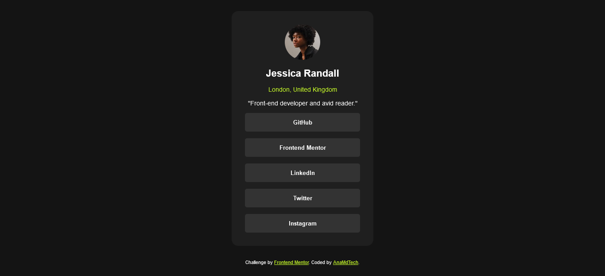

# Frontend Mentor - Social Links Profile Solution

This is a solution to the [Social Links Profile challenge on Frontend Mentor](https://www.frontendmentor.io/challenges/social-links-profile-UG32l9m6dQ). Frontend Mentor challenges are designed to enhance your coding skills by working on realistic projects.

## Table of contents

- [Overview](#overview)
  - [The challenge](#the-challenge)
  - [Screenshot](#screenshot)
  - [Links](#links)
- [My process](#my-process)
  - [Built with](#built-with)
  - [What I learned](#what-i-learned)
  - [Continued development](#continued-development)
  - [Useful resources](#useful-resources)
- [Author](#author)
- [Acknowledgments](#acknowledgments)

---

## Overview

### The challenge

Users should be able to:

- View hover and focus states for all interactive elements on the page.

### Screenshot



### Links

- [Solution URL](https://github.com/AnaMdTech/social-links-profile-card.git)
- [Live Site URL](https://social-links-profile-card-ana-md.netlify.app/)

## My process

### Built with

- Semantic HTML5 markup
- CSS custom properties
- Flexbox
- Mobile-first workflow

### What I learned

This project helped reinforce the use of CSS custom properties and hover/focus states for interactive elements. Below is an example of a hover effect applied to the social links:

```css
.link:hover {
  background-color: hsl(75, 94%, 57%);
  color: hsl(0, 0%, 8%);
}
```

Additionally, I improved my understanding of using custom fonts with the `@font-face` rule to load different font weights dynamically.

```css
@font-face {
  font-family: "Inter";
  src: url("../fonts/Inter-Regular.ttf") format("truetype");
  font-weight: 400;
  font-style: normal;
}
```

### Continued development

In future projects, I plan to:

- Explore more advanced styling techniques, such as animations.
- Improve accessibility for all users by testing with screen readers.
- Make the design more responsive for a wider range of devices.

### Useful resources

- [MDN Web Docs: @font-face](https://developer.mozilla.org/en-US/docs/Web/CSS/@font-face) - A great resource to learn how to define and use custom fonts.
- [Frontend Mentor Challenges](https://www.frontendmentor.io/challenges) - Provides a variety of projects to practice front-end development.

## Author

- Website: [AnaMdTech](https://github.com/AnaMdTech/)
- Frontend Mentor: [@AnaMdTech](https://www.frontendmentor.io/profile/AnaMdTech)

## Acknowledgments

Big thanks to [Frontend Mentor](https://www.frontendmentor.io) for providing this challenge and helping developers worldwide improve their skills.
